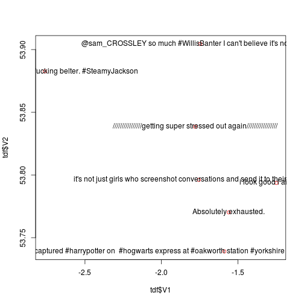

# Loading twitter json files in R

R is adept at working with real data. As a conseqence, many packages
have been developed for extracting data from various formats and dumping
them into standard R *classes* such as data.frame, list or even
SpatialPolygonsDataFrame.

.json is an increasingly common file format. Here we see how to access
the data within .json files, using the library **rjson**. If you do not have
this package already, `install.packages(rjson)` will install it.
Let's try opening up some twitter data.


```r
library(rjson)
tweet <- fromJSON(file = "data/tweets.json")  # loads 1st tweet, but no more
names(tweet)  # show the list names - what data has been loaded
```

```
##  [1] "created_at"                "id"                       
##  [3] "id_str"                    "text"                     
##  [5] "source"                    "truncated"                
##  [7] "in_reply_to_status_id"     "in_reply_to_status_id_str"
##  [9] "in_reply_to_user_id"       "in_reply_to_user_id_str"  
## [11] "in_reply_to_screen_name"   "user"                     
## [13] "geo"                       "coordinates"              
## [15] "place"                     "contributors"             
## [17] "retweet_count"             "favorite_count"           
## [19] "entities"                  "favorited"                
## [21] "retweeted"                 "filter_level"             
## [23] "lang"
```

```r
tweet$text  # the text
```

```
## [1] "That awkward moment"
```


To load more than one tweet in R using this library, the code gets more complex:


```r
ts <- fromJSON(sprintf("[%s]", paste(readLines("data/tweets.json"), collapse = ",")))
ts[[2]]$text
```

```
## [1] "Absolutely exhausted."
```

```r
ts[[1]]$coordinates$coordinates  # the coordinates
```

```
## [1] -1.56 53.77
```


The above code shows that each tweet's information is now stored as
a separate list item. `ts` is a series of lists within lists!
Extracting the data into a neat data frame requires the use of the bizarre
`sapply` function:


```r
sapply(ts, function(x) x$coordinates$coordinates)[[1]]  # the extracted coords
```

```
## [1] -1.56 53.77
```

```r
coords <- matrix(unlist(sapply(ts, function(x) x$coordinates$coordinates)), 
    ncol = 2, byrow = T)
coords <- as.data.frame(coords)
coords  # successful extraction of coordinates
```

```
##       V1    V2
## 1 -1.560 53.77
## 2 -1.588 53.74
## 3 -1.755 53.80
## 4 -1.248 53.79
## 5 -2.762 53.88
## 6 -1.746 53.90
## 7 -1.779 53.84
```


The method is the same for any attribute.
Let's extract the text variable, as an example, and add it to the
coordinates data:


```r
text <- sapply(ts, function(x) x$text)
text <- unlist(text)[-1]
text[1:3]
```

```
## [1] "Absolutely exhausted."                                                                                                                       
## [2] "Inadvertently captured #harrypotter on  #hogwarts express at #oakworth station #yorkshire #photography @visitBradford http://t.co/P5LRNf4vOK"
## [3] "it's not just girls who screenshot conversations and send it to their bestfriends"
```

```r
tdf <- data.frame(text = text)  # create R data.frame
tdf <- cbind(tdf, coords)
tdf
```

```
##                                                                                                                                           text
## 1                                                                                                                        Absolutely exhausted.
## 2 Inadvertently captured #harrypotter on  #hogwarts express at #oakworth station #yorkshire #photography @visitBradford http://t.co/P5LRNf4vOK
## 3                                                            it's not just girls who screenshot conversations and send it to their bestfriends
## 4                                                                                                                  i look good i ain't lost it
## 5                                                                                       Well that weekend was a fucking belter. #SteamyJackson
## 6                                                                        @sam_CROSSLEY so much #WillisBanter I can't believe it's not trending
## 7                                                                            ////////////////getting super stressed out again/////////////////
##       V1    V2
## 1 -1.560 53.77
## 2 -1.588 53.74
## 3 -1.755 53.80
## 4 -1.248 53.79
## 5 -2.762 53.88
## 6 -1.746 53.90
## 7 -1.779 53.84
```


Let's plot the data (in a very rudimentary form) to prove we have 'geotagged'
data:


```r
plot(tdf$V1, tdf$V2, col = "red")
text(tdf$V1, tdf$V2, labels = tdf$text)
```

 

